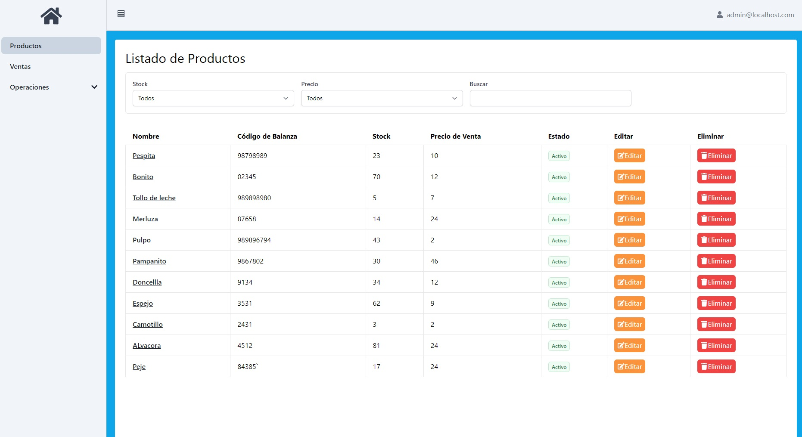
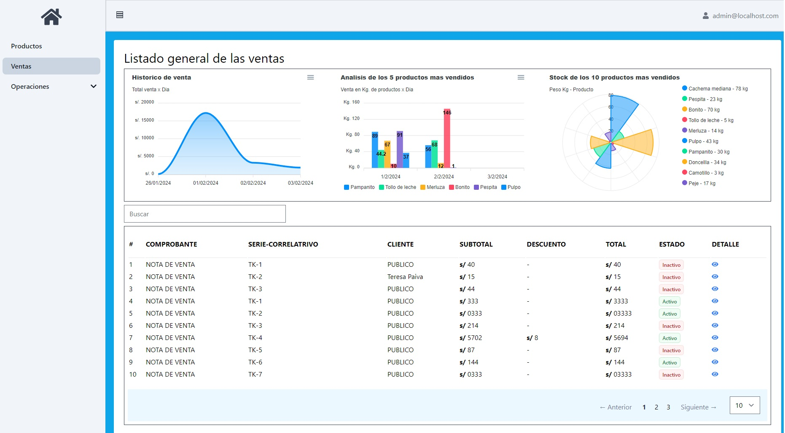
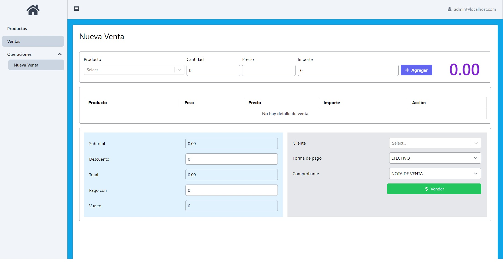

# PESCADERIAS PIURA FISH 

## Descripción

Esta es una aplicación de React que se utiliza para la gestión de ventas. Permite realizar ventas, crear, editar y eliminar productos. También proporciona análisis de datos con gráficos para ayudar a entender mejor el rendimiento de las ventas.

## Características

- **Análisis de datos:** Proporciona gráficos para analizar el rendimiento de las ventas.
- **Gestión de productos:** Los usuarios pueden crear, editar y eliminar productos.
- **Gestión de ventas:** Ayuda a los usuarios a gestionar y rastrear las ventas.

## Capturas de pantalla

### Listado de productos

### Análisis de datos - ventas

### Nueva venta

## Instalación

Para instalar y ejecutar esta aplicación, sigue estos pasos:

1. Clona el repositorio: `git clone https://github.com/inforux/pescaderias.git`
2. Instala las dependencias: `npm install`
3. Ejecuta la aplicación: `npm start`

## Licencia

Esta aplicación está bajo la licencia MIT. Consulta el archivo `LICENSE` para más detalles.